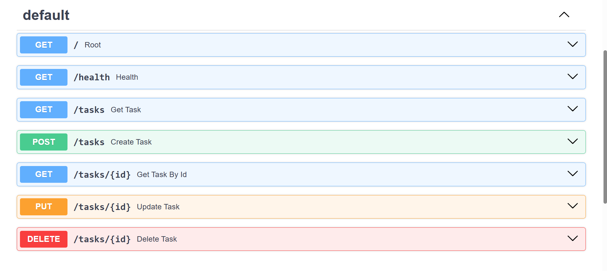

# Task API

A simple CRUD API built using FastAPI.

## Installation

pip install -r requirements.txt

## Run

uvicorn main:app --reload

## Endpoints

| Method | Endpoint |
|--------|----------|
| GET | / |
| GET | /health |
| GET | /tasks |
| GET | /tasks/{id} |
| POST | /tasks |
| PUT | /tasks/{id} |
| DELETE | /tasks/{id} |

## Swagger UI Screenshot

